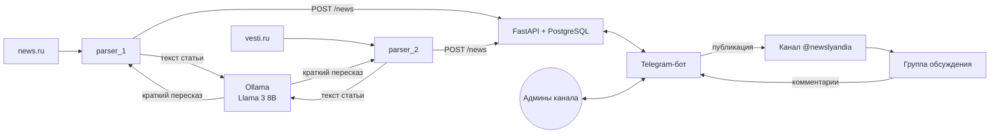

# 📰 Newslyandia

Автоматический новостной Telegram-канал. Парсеры собирают свежие статьи с новостных сайтов, локальная LLM (Llama 3 через Ollama) пересказывает каждую в несколько предложений, а админы канала просматривают, редактируют и публикуют новости прямо из Telegram-бота. Там же бот проводит розыгрыши среди комментаторов.


## Как это работает



1. **Парсер** по расписанию открывает главную страницу сайта в headless-браузере, собирает ссылки своего домена и для каждой проверяет, статья ли это (Mozilla Readability, порог по количеству слов).
2. Из статьи извлекаются заголовок, текст и обложка (`og:image`).
3. Текст уходит в **локальную LLM** с промптом: выделить главную новость и пересказать её в нескольких предложениях в нейтральном тоне.
4. Результат сохраняется через **API** в Postgres. Повторная статья отсекается по уникальному URL.
5. Админ пишет боту `/news` и получает список новостей: превью, полный текст, правка, публикация в канал с подписью-призывом.
6. **Розыгрыши:** `/create_giveaway` публикует конкурсный пост, бот собирает комментаторов из группы обсуждения, `/select_winner` выбирает победителя.

## Сервисы

| Сервис | Что делает | Стек |
| --- | --- | --- |
| [`newslyandia-parser`](newslyandia-parser) | Поиск и разбор статей, пересказ через LLM, отправка в API. Один образ запускается несколько раз — по контейнеру на источник (`NEWS_LINK`) | FastAPI (lifespan), APScheduler, Playwright, BeautifulSoup, Readability.js |
| [`newslyandia-model`](newslyandia-model) | Локальная LLM, при старте подтягивает модель | Ollama, Llama 3 8B |
| [`newslyandia-fastapi`](newslyandia-fastapi) | Хранение новостей и розыгрышей, REST API | FastAPI, SQLAlchemy, Alembic, PostgreSQL |
| [`newslyandia-bot`](newslyandia-bot) | Модерация и публикация новостей, розыгрыши. Доступ только у админов канала | Telethon, httpx |

## Технические детали

- **Микросервисы в одном Docker Compose**: БД, API, бот, два парсера и LLM, общение по HTTP внутри сети compose
- **Горизонтальное масштабирование парсеров**: новый источник — это новый контейнер того же образа с другой переменной `NEWS_LINK`
- **Защита от наложения задач**: `asyncio.Lock` пропускает запуск, если предыдущий проход по сайту ещё не закончился
- **Локальная LLM без внешних API**: Ollama на CPU с ограничением ресурсов контейнера (`cpus`, `mem_limit`)
- **Извлечение статей «как в Firefox»**: Readability.js внедряется в страницу Playwright, поэтому не нужно писать отдельный парсер под вёрстку каждого сайта
- **Мягкое удаление новостей** через поле `deleted_at`
- **API разбит на слои**: `handler` → `service` → `repository`, зависимости через `Depends`
- **Доступ к боту** ограничен списком админов канала на уровне фильтров событий Telethon

## Запуск

Нужны Docker и Docker Compose. Модель весит около 5 ГБ и при первом запуске скачивается автоматически.

1. Создай Telegram-бота у [@BotFather](https://t.me/BotFather), получи `API_ID` и `API_HASH` на [my.telegram.org](https://my.telegram.org), добавь бота админом в канал и группу обсуждения.
2. Создай `.dev.env` в каждом сервисе по примеру `.env.example`.
3. Подними всё:

```bash
docker compose -f docker-compose.dev.yml up -d --build
make alembic_dev_upgrade_app   # миграции
```

4. Напиши боту `/news`.

| Сервис | Порт |
| --- | --- |
| API (Swagger: `/docs`) | 8000 |
| Бот | 8001 |
| Парсеры | 8003, 8004 |
| Ollama | 11434 |
| PostgreSQL | 5432 |
